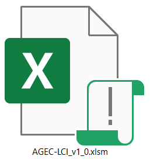
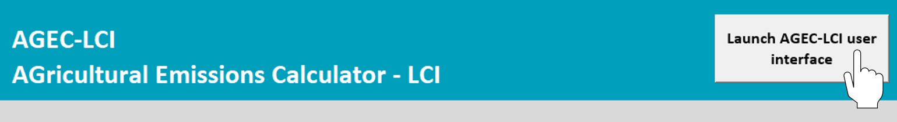
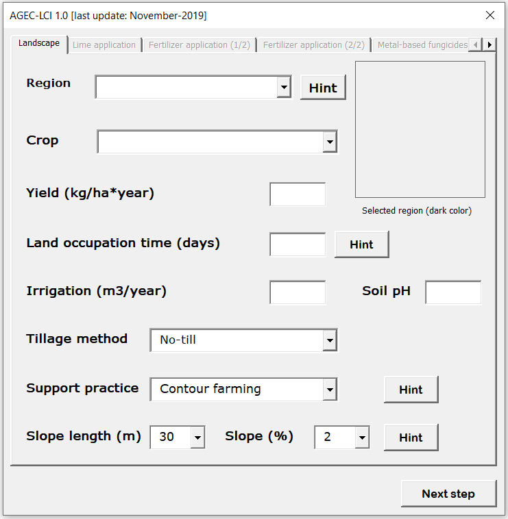
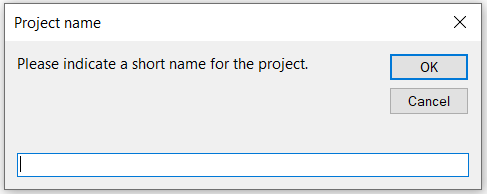
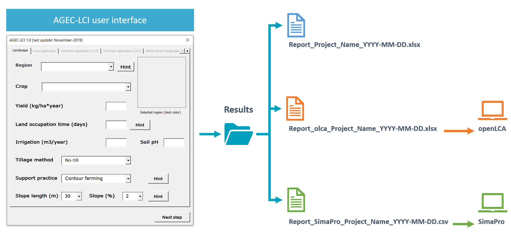

```{r include = FALSE}
if(!knitr:::is_html_output())
{
  options("width"=56)
  knitr::opts_chunk$set(tidy.opts=list(width.cutoff=56, indent = 2), tidy = TRUE)
  knitr::opts_chunk$set(fig.pos ='ht')
}
```

# Instructions for use {#instructions}


#### Step 1 {-}

Unzip the compressed folder AGEC-LCI_v1_0.zip, then open the file AGEC-LCI_v1_0.xlsm (Figure \@ref(fig:agec-icon)).

```{r agec-icon,echo=FALSE,fig.align='center',out.width="15%",fig.cap="AGEC-LCI is stored in a macro-enabled workbook"}

```


#### Step 2 {-}

Click on the Launch AGEC-LCI user interface button at the top of README-RUN worksheet of AGEC-LCI_v1_0.xlsm (Figure \@ref(fig:agec-lci-step1)). 

```{r agec-lci-step1,echo=FALSE,fig.align='center',out.width="85%",fig.cap="Launch AGEC-LCI user interface"}

```


#### Step 3 {-}

The AGEC-LCI user interface will be displayed (Figure \@ref(fig:agec-lci-step2)).

```{r agec-lci-step2,echo=FALSE,fig.align='center',fig.cap="AGEC-LCI user interface",out.width="65%"}

```

AGEC-LCI allows the user to select inputs from a database composed of 25 crops (Table \@ref(tab:crops-agec)), 42 fertilizers (Table \@ref(tab:ferti-agec)), 6 metal-based fungicides (Table \@ref(tab:fungicides-agec)) and the pedo-climatic characteristics of 5 French regions (Figure \@ref(fig:regions-agec-lci)) according to data from AGRIBALYSE [@Koch2015]. Furthermore, the user is allowed to add crops, regions and other inputs not available in the accompanying database.


```{r, echo=FALSE,warning=FALSE,message=FALSE}
library(kableExtra)
library(dplyr)
library(readxl)

df_ferti <- read_excel("agec-lci-inputs.xlsx",sheet = "Fertilizers",skip = 0)
df_crop <- read_excel("agec-lci-inputs.xlsx",sheet = "Crops",skip = 0)
df_fungi <- read_excel("agec-lci-inputs.xlsx",sheet = "Fungicides",skip = 0)
```


```{r crops-agec,echo=FALSE,message=FALSE,warning=FALSE}
kable(df_crop,caption = "Crops available in AGEC-LCI") %>%
  kable_styling(bootstrap_options = c("striped", "hover"),full_width = F) %>%
  scroll_box(height = "200px")
```


<br></br>


```{r ferti-agec,echo=FALSE,message=FALSE,warning=FALSE}
kable(df_ferti,caption = "Fertilizers available in AGEC-LCI") %>%
  kable_styling(bootstrap_options = c("striped", "hover"),full_width = F) %>%
  scroll_box(height = "200px")
```


<br></br>


```{r fungicides-agec,echo=FALSE,message=FALSE,warning=FALSE}
kable(df_fungi,caption = "Metal-based fungicides available in AGEC-LCI") %>%
  kable_styling(bootstrap_options = c("striped", "hover"),full_width = F)
```

<br><br/>

> Click on the coloured polygons to display the main characteristics of the available regions in AGEC-LCI.

```{r,echo=FALSE,warning=FALSE,message=FALSE}
library(leaflet)
library(rgdal)
library(dplyr)
```

```{r regions-agec-lci,echo=FALSE,warning=FALSE,message=FALSE,fig.cap="Regions available in AGEC-LCI"}
regions_france <- readOGR("Figures/france_4_agec_lci_4326.geojson",use_iconv = TRUE,encoding = "UTF-8",verbose = FALSE)

df_regions <- regions_france@data

full_pal <- c("#466791","#60bf37","#953ada","#4fbe6c","#ce49d3","#a7b43d","#5a51dc","#d49f36","#552095","#507f2d","#db37aa","#84b67c","#a06fda","#df462a","#5b83db","#c76c2d","#4f49a3","#82702d","#dd6bbb","#334c22","#d83979","#55baad","#dc4555","#62aad3","#8c3025","#417d61","#862977","#bba672","#403367","#da8a6d","#a79cd4","#71482c","#c689d0","#6b2940","#d593a7","#895c8b","#bd5975")

pal <- full_pal[1:22]

df_regions <- df_regions %>%
  dplyr::mutate(popup_info = paste("<b>Region:</b>",Region,"<br />",
                                   "<b>Region of France:</b>",Reg_Region.of.France,"<br />",
                                   "<b>Average precipitation (mm/year):</b>",Reg_T_Annual_Prec,"<br />",
                                   "<b>Average temperature (°C):</b>",Reg_A_Annual_Temp,"<br />",
                                   "<b>R (USDA RUSLE):</b>",Reg_R_RUSLE,"<br />",
                                   "<b>K (USDA RUSLE):</b>",Reg_K_RUSLE,"<br />"))


leaflet() %>%
  addTiles() %>%
  addPolygons(data = regions_france,stroke = TRUE,color = ~pal,weight = 2,fill = TRUE,fillColor = ~pal,fillOpacity = 0.75,popup = df_regions$popup_info) %>%
  addMiniMap() %>%
  addLayersControl(
    overlayGroups = c("AGEC-LCI regions"),
    options = layersControlOptions(collapsed = TRUE)
  )
```


#### Step 4 {-}

You will be asked to give a short name for your current project. It is advised to give a short and meaningful name, because it will be part of the name of the reports and the process generated (Figure \@ref(fig:agec-lci-step3)). Click OK to finish the computations.

```{r agec-lci-step3,echo=FALSE,fig.align='center',fig.cap="Name your current project"}

```

#### Step 5 {-}

Three reports will be generated and stored under the Results folder accompanying this tool (Figure \@ref(fig:agec-lci-step4)). The Results folder will be automatically open at the end of the computation.  

- **Report_Project_Name_YYYY-MM-DD.xlsx**: Contains the user’s inputs and the calculated emissions. The aim of this report is to keep track of the inputs that need to be entered by the LCA practitioner into a LCA software.

- **Report_olca_Project_Name_YYYY-MM-DD.xlsx**: Reports the calculated emissions in an Excel file compatible with openLCA. The importation of this report was tested with openLCA 1.9.0, and the procedure is described in [Section](#import-olca) \@ref(import-olca).

- **Report_SimaPro_Project_Name_YYYY-MM-DD.csv**: Reports the calculated emissions in a csv file compatible with SimaPro. The importation of this csv file was tested with SimaPro 8.5.2.2, it is not guaranteed that it will work in previous versions the software. The procedure for importing this file is described in [Section](#import-simapro) \@ref(import-simapro).


```{r agec-lci-step4,echo=FALSE,fig.align='center',fig.cap="Files generated by AGEC-LCI",out.width="95%"}

```


