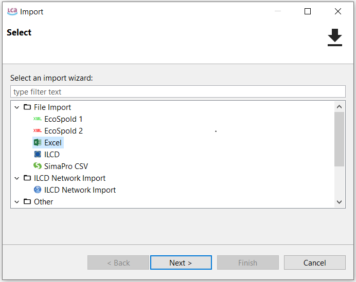
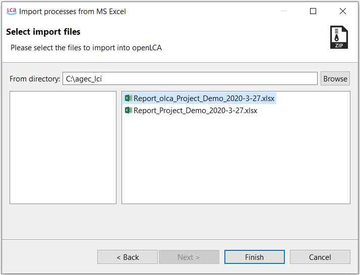
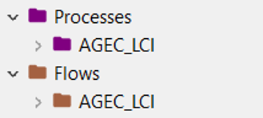
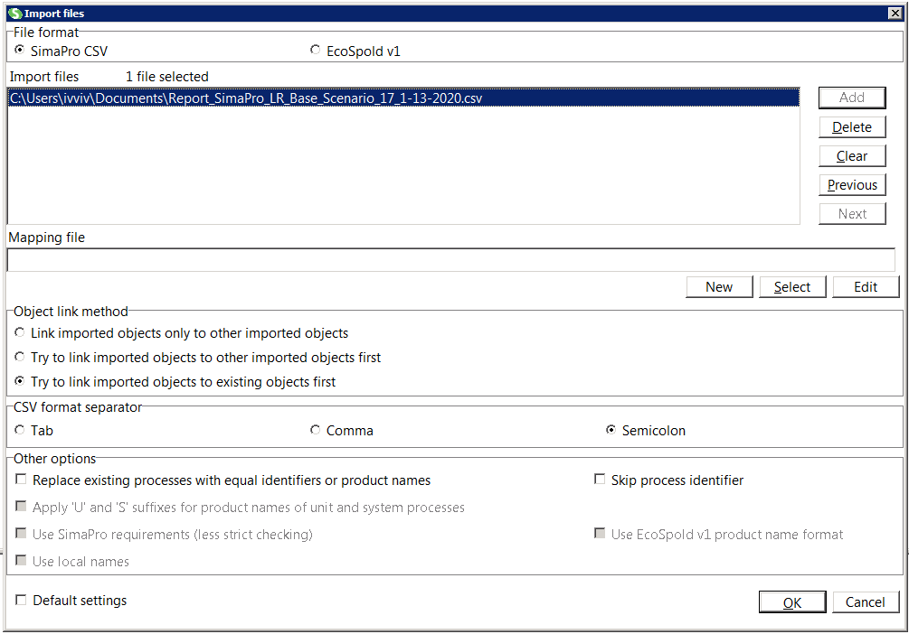
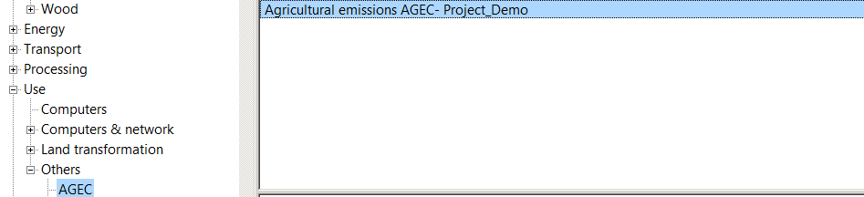

```{r include = FALSE}
if(!knitr:::is_html_output())
{
  options("width"=56)
  knitr::opts_chunk$set(tidy.opts=list(width.cutoff=56, indent = 2), tidy = TRUE)
  knitr::opts_chunk$set(fig.pos = 'ht')
}
```

# Importing AGEC-LCI reports into LCA software

AGEC-LCI generates reports that can be directly imported into LCA software such as [openLCA](http://www.openlca.org/openlca/){target="_blank"} and [SimaPro](https://simapro.com/){target="_blank"}, which greatly reduces the time required for computing the impact of emissions resulting from soil amendments, fertilizers and metal-based fungicides.

## openLCA {#import-olca}


1. Activate your working database

2. Under *File*, select import.

3. Select the *Excel* file format and click on Next (Figure \@ref(fig:olca-step1)).

```{r  olca-step1,echo=FALSE,fig.align='center',fig.cap="Importing an Excel file into openLCA",out.width="70%"}

```


4. Find the *AGEC-LCI report in Excel format* you would like to import. The name of the AGEC-LCI report compatible with openLCA follows the pattern "Report_olca_Project_Name_YYYY-MM-DD.xlsx". Of course, you can rename this file prior to its importation into openLCA.


5. Select the file to be imported and click on finish (Figure \@ref(fig:olca-step2)). 

```{r olca-step2,echo=FALSE,fig.align='center',out.width="70%",fig.cap="Selecting the file to be imported"}

```

6.	After the importation, a child category AGEC-LCI will be created under Processes and Flows from the navigation panel (Figure \@ref(fig:olca-step3)).


```{r olca-step3,echo=FALSE,fig.align='center',out.width="40%",fig.cap="Child categories added to Processes and Flows"}

```


## SimaPro {#import-simapro}

1.	Open your project

2.	Under *File*, select import.

3.	Click on Add.

4.	Select the csv file for importing (Figure \@ref(fig:simapro-step1)). 

```{r simapro-step1,echo=FALSE,fig.align='center',out.width="85%",fig.cap="Importing a csv file into SimaPro"}

```


5.	Click OK to launch the importation.

6. After the importation, a child category AGEC will be created under Processes/Use/Others (Figure \@ref(fig:simapro-step2)).

```{r simapro-step2,echo=FALSE,fig.align='center',out.width="85%",fig.cap="Child category added after importation"}

```

**Notes:**

- The default name of the flow generated by AGEC-LCI is *Agricultural emissions, AGEC*.

- The default name of the process is composed by concatenation of the strings *"Agricultural emissions, AGEC-LCI-"* and *"Your Project Name"*, which you entered at step 3 of the [instructions for use](#instructions).


