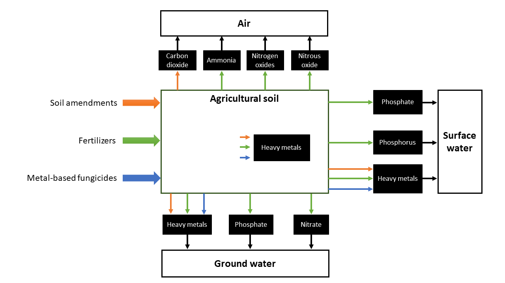

# Introduction

AGEC-LCI is a VBA application hosted in Microsoft Excel that computes emissions generated from the application of soil amendments, fertilizers and metal-based fungicides in agriculture (Figure \@ref(fig:agec-lci-emissions)).

(\#fig:agec-lci-emissions)Emissions Computed by AGEC-LCI

A state of the art analysis of the models for computing direct field emission from fertilizers, pesticides and soil amendments was carried out. Acknowledging that agricultural emissions are site- and time dependent, a parsimonious approach was considered for the selection of the models (Table \@ref(tab:agec-models)). See [Section](#selected-methods) \@ref(selected-methods) for more details on the selected models.

Table: (\#tab:agec-models) Selected models for calculating agricultural emissions and comparison with LCI databases

|Emission| [agri footprint](https://www.agri-footprint.com/){target="_blank"} [@durlinger2017]| [ecoinvent v3](https://www.ecoinvent.org/){target="_blank"} [@nemecek2011]| [AGRIBALYSE ®](https://www.ademe.fr/en/expertise/alternative-approaches-to-production/agribalyse-program){target="_blank"} [@Koch2015]| [WFLDB](https://quantis-intl.com/tools/databases/wfldb-food/){target="_blank"} [@nemecek2014]| AGEC-LCI|
|------------|----------------|------------|-------------|------------|-----------------|
|Ammonia (NH~3~)|IPCC (2006)|Agrammon (Tier 3 methodology for Switzerland)|EMEP Tier 2 (EEA 2009)|EMEP Tier 2 (EEA 2013)|EMEP Tier 2 (EEA 2009 & EEA 2013)| 
|Nitrous oxide (N~2~O)|IPCC (2006)|IPCC (2006) crops: Tier 1 animals: Tier 2|IPCC (2006) crops: Tier 1 animals: Tier 2|IPCC (2006) crops: Tier 1 animals: Tier 2|"IPCC (2006) crops: Tier 1^(a)^|
|Nitrate (NO~3~^-^)|IPCC (2006)|Europe: SALCA-Nitrate (Richner et al. 2014), Other countries: SQCB (Faist et al, 2009)|Annual French crops: COMIFER 2001 adjusted (Tailleur et al. 2012),Permanent crops: SQCB (Faist et al, 2009)|Europe: SALCA-Nitrate (Richner et al. 2014), Other countries: SQCB (Faist et al, 2009)|SQCB (Faist et al, 2009)|
|Phosphorus (P,PO~4~^3-^)|(Struijs, Beusen, Zwart, & Huijbregts, 2011)|SALCA-P (Prasuhn, 2006)|SALCA-P (Prasuhn, 2006)|SALCA-P (Prasuhn, 2006)|SALCA-P (Prasuhn, 2006)|SALCA-P (Prasuhn, 2006)|
|Heavy metals (Cd, Cr, Cu, Hg, Ni, Pb, Zn)|(Mels et al., 2008, Romkens & Rietra, 2008, Nemecek & Schnetzer, 2012)|SALCA method (Freiermuth, 2006)|SALCA method (Freiermuth, 2006)|SALCA method (Freiermuth, 2006)|SALCA method (Freiermuth, 2006)|
|Methane (CH~4~)|Dutch National Inventory Reports|IPCC (2006) Tier 2|IPCC (2006) Tier 2|IPCC (2006) Tier 2|-|
|Synthetic pesticides|100 % of the substance emitted to agricultural soil|100 % of the substance emitted to agricultural soil|100 % of the substance emitted to agricultural soil|100 % of the substance emitted to soil^(b)^|-|

(a): The AGEC-LCI tool does not compute enteric emissions of livestock.

(b): Rule followed in the first and second release of the WFLDB. The third release will follow the rules defined in Glasgow workshops [@nemecek2014].

