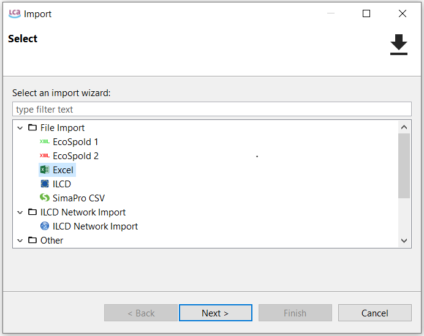
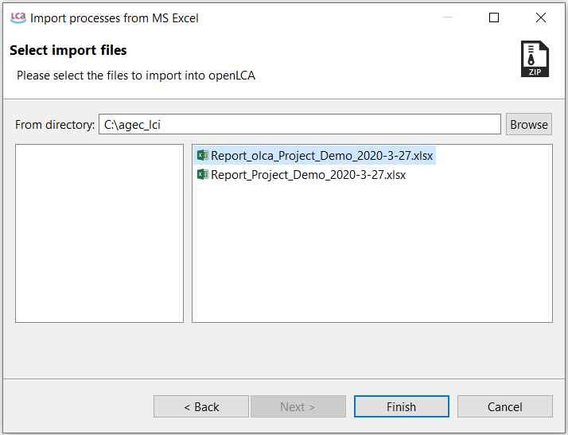
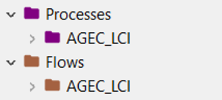
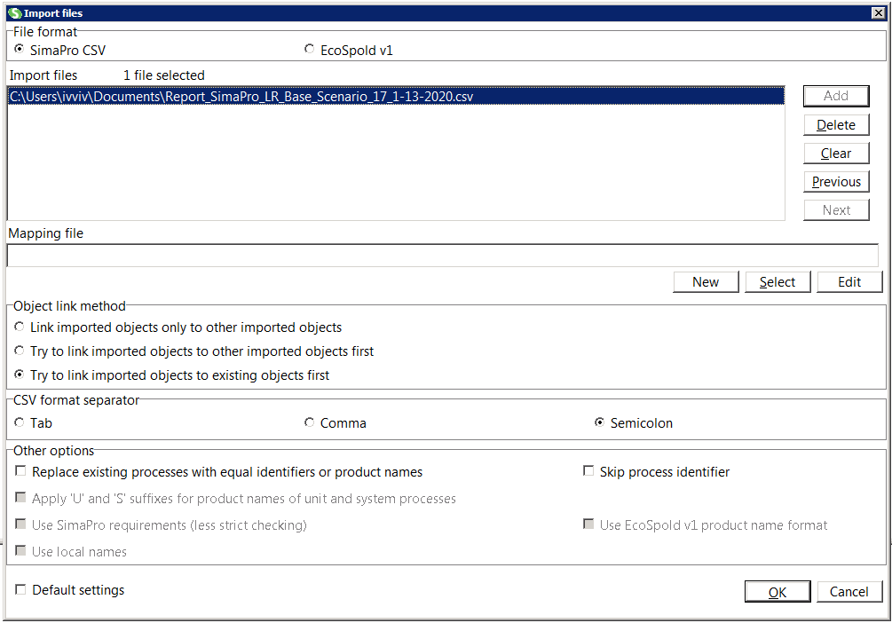
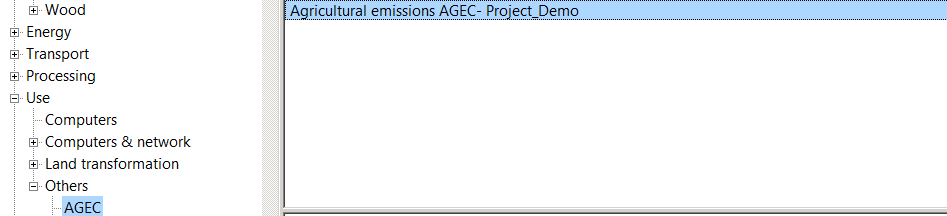

# Importing AGEC-LCI reports into LCA software

AGEC-LCI generates reports that can be directly imported into LCA software such as [openLCA](http://www.openlca.org/openlca/){target="_blank"} and [SimaPro](https://simapro.com/){target="_blank"}, which greatly reduces the time required for computing the impact of emissions resulting from soil amendments, fertilizers and metal-based fungicides.

## openLCA {#import-olca}

1. Activate your working database

2. Under *File*, select import.

3. Select the *Excel* file format and click on Next (Figure \@ref(fig:olca-step1)).

(\#fig:olca-step1)Importing an Excel file into openLCA

4. Find the *AGEC-LCI report in Excel format* you would like to import. The name of the AGEC-LCI report compatible with openLCA follows the pattern "Report_olca_Project_Name_YYYY-MM-DD.xlsx". Of course, you can rename this file prior to its importation into openLCA.

5. Select the file to be imported and click on finish (Figure \@ref(fig:olca-step2)). 

(\#fig:olca-step2)Selecting the file to be imported

6.	After the importation, a child category AGEC-LCI will be created under Processes and Flows from the navigation panel (Figure \@ref(fig:olca-step3)).

(\#fig:olca-step3)Child categories added to Processes and Flows

## SimaPro {#import-simapro}

1.	Open your project

2.	Under *File*, select import.

3.	Click on Add.

4.	Select the csv file for importing (Figure \@ref(fig:simapro-step1)). 

(\#fig:simapro-step1)Importing a csv file into SimaPro

5.	Click OK to launch the importation.

6. After the importation, a child category AGEC will be created under Processes/Use/Others (Figure \@ref(fig:simapro-step2)).

(\#fig:simapro-step2)Child category added after importation

**Notes:**

- The default name of the flow generated by AGEC-LCI is *Agricultural emissions, AGEC*.

- The default name of the process is composed by concatenation of the strings *"Agricultural emissions, AGEC-LCI-"* and *"Your Project Name"*, which you entered at step 3 of the [instructions for use](#instructions).

